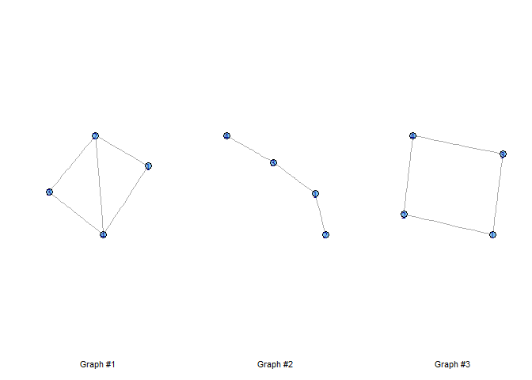
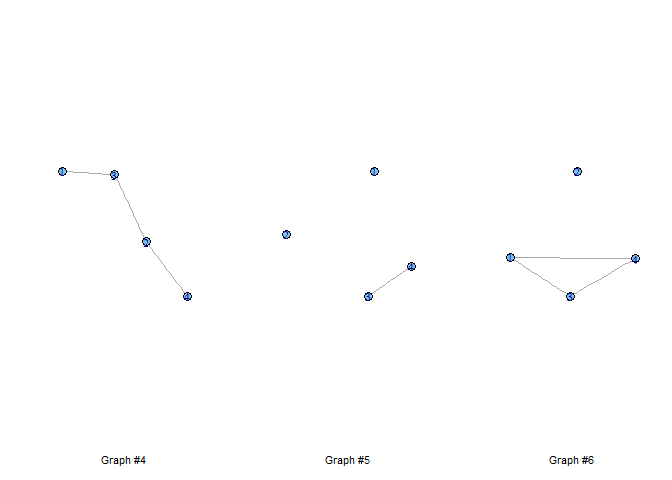
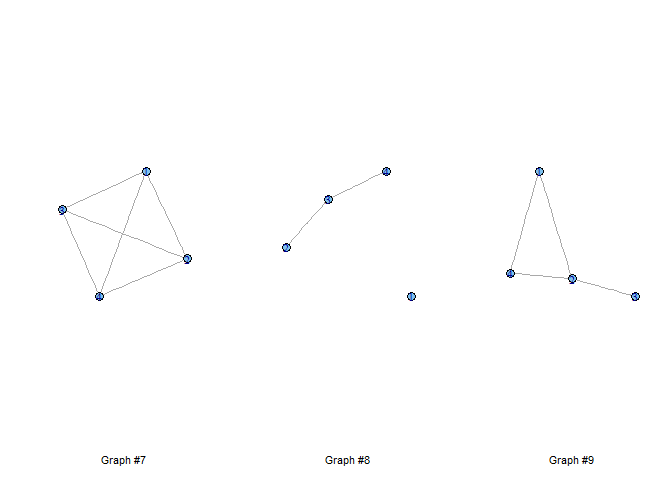
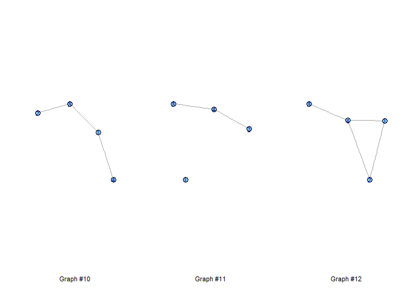
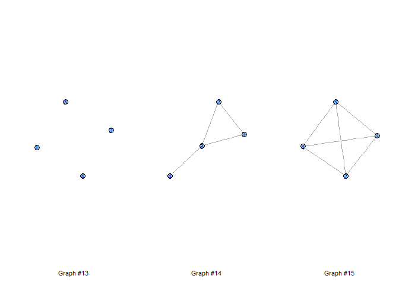
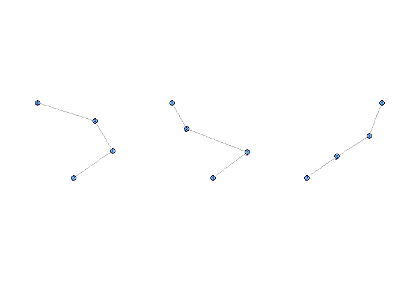
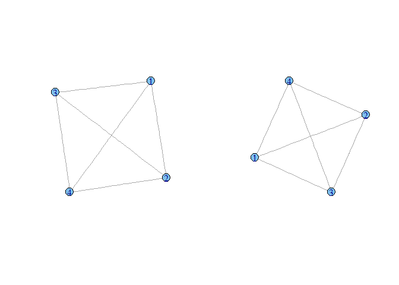
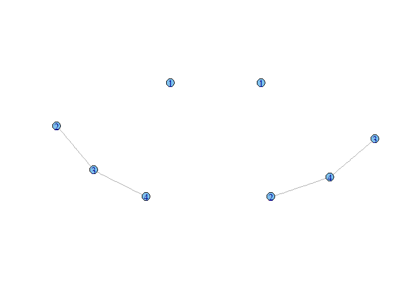
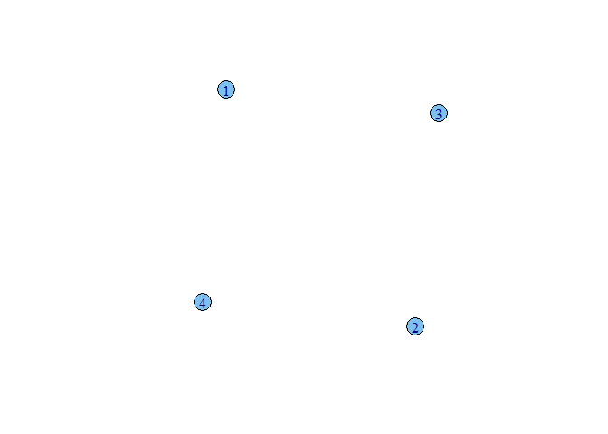

# Some playing with graphs #1
Rail Suleymanov  
Thursday, April 16, 2015  

This is a demo document on graphs - generations and some calculations (case of undirected graphs).

We begin with loading graph library and some useful functions:


```r
library(igraph)
source("graph_funcs.R")
```

Then we generate 15 graphs, each consisting of 4 nodes, with probability of 0.5 of having and edge between any arbitrary edges. We will also define uniform initial and stopping probabilities for all graphs and calculate direct product of those probabilities:


```r
set.seed(2015)
gfs <- gen_seq_graphs(15, 4, "undir", 0.5)
p <- matrix(rep(0.25, 4), nrow = 4)
q <- p
px <- kronecker(p, p)
qx <- kronecker(q, q)
```

Now we plot the graphs:


```r
par(mfrow = c(1, 3))
for (i in 1:5) {
    for (j in 1:3) {
        ind <- (i - 1) * 3 + j
        xlab <- paste("Graph #", ind, sep = "")
        plot(gfs[[ind]][[2]], xlab = xlab)
    }
}
```

     

Now we try to find all pairs of isomorphic graphs using standard functions:


```r
print_isomorphs(gfs)
```

```
## [1] 2 4
## [1]  2 10
## [1]  4 10
## [1]  7 15
## [1]  8 11
## [1]  9 12
## [1]  9 14
## [1] 12 14
```

Examining the output, we can conclude that following groups of graphs are isomorphic:

- 2, 4, 10

- 7, 15

- 8, 11

- 9, 12, 14.

Sample graph adjacency matrices from first group:


```r
print(gfs[[2]][[1]])
```

```
##      [,1] [,2] [,3] [,4]
## [1,]    0    1    1    0
## [2,]    1    0    0    0
## [3,]    1    0    0    1
## [4,]    0    0    1    0
```

```r
print(gfs[[4]][[1]])
```

```
##      [,1] [,2] [,3] [,4]
## [1,]    0    0    1    0
## [2,]    0    0    1    1
## [3,]    1    1    0    0
## [4,]    0    1    0    0
```

```r
print(gfs[[10]][[1]])
```

```
##      [,1] [,2] [,3] [,4]
## [1,]    0    0    1    1
## [2,]    0    0    1    0
## [3,]    1    1    0    0
## [4,]    1    0    0    0
```

Let's plot those groups:


```r
par(mfrow = c(1, 3))
plot(gfs[[2]][[2]])
plot(gfs[[4]][[2]])
plot(gfs[[10]][[2]])
```

 

```r
par(mfrow = c(1, 2))
plot(gfs[[7]][[2]])
plot(gfs[[15]][[2]])
```

 

```r
par(mfrow = c(1, 2))
plot(gfs[[8]][[2]])
plot(gfs[[11]][[2]])
```

 

```r
par(mfrow = c(1, 3))
plot(gfs[[9]][[2]])
plot(gfs[[12]][[2]])
plot(gfs[[14]][[2]])
```

 

Now, let's compute direct product of second graph with itself:


```r
options(width = 200)
g2_2 <- direct_product(gfs[[2]], gfs[[2]], "undir")
```

And compute direct products of all first group isomorphs:


```r
g2_4 <- direct_product(gfs[[2]], gfs[[4]], "undir")
g2_10 <- direct_product(gfs[[2]], gfs[[10]], "undir")
g4_10 <- direct_product(gfs[[4]], gfs[[10]], "undir")
```

Now we compute some kernel values for first group isomorphs (for powers 1, 5):


```r
print(kernel1(g2_2[[1]], 1))
```

```
##          [,1]
## [1,] 0.203125
```

```r
print(kernel1(g2_4[[1]], 1))
```

```
##          [,1]
## [1,] 0.203125
```

```r
print(kernel1(g2_10[[1]], 1))
```

```
##          [,1]
## [1,] 0.203125
```

```r
print(kernel1(g4_10[[1]], 1))
```

```
##          [,1]
## [1,] 0.203125
```

```r
print(kernel1(g2_2[[1]], 5))
```

```
##        [,1]
## [1,] 11.125
```

```r
print(kernel1(g2_4[[1]], 5))
```

```
##        [,1]
## [1,] 11.125
```

```r
print(kernel1(g2_10[[1]], 5))
```

```
##        [,1]
## [1,] 11.125
```

```r
print(kernel1(g4_10[[1]], 5))
```

```
##        [,1]
## [1,] 11.125
```

Now we compute some kernel values within second group:


```r
g7_7 <- direct_product(gfs[[7]], gfs[[7]], "undir")
g7_15 <- direct_product(gfs[[7]], gfs[[15]], "undir")
print(kernel1(g7_7[[1]], 1))
```

```
##       [,1]
## [1,] 0.625
```

```r
print(kernel1(g7_15[[1]], 1))
```

```
##       [,1]
## [1,] 0.625
```

```r
print(kernel1(g7_7[[1]], 5))
```

```
##          [,1]
## [1,] 4151.875
```

```r
print(kernel1(g7_15[[1]], 5))
```

```
##          [,1]
## [1,] 4151.875
```

Now we compute some kernel values across groups:


```r
g2_7 <- direct_product(gfs[[2]], gfs[[7]], "undir")
g2_8 <- direct_product(gfs[[2]], gfs[[8]], "undir")
g2_9 <- direct_product(gfs[[2]], gfs[[9]], "undir")
g7_8 <- direct_product(gfs[[7]], gfs[[8]], "undir")
g7_9 <- direct_product(gfs[[7]], gfs[[8]], "undir")
g8_9 <- direct_product(gfs[[8]], gfs[[9]], "undir")
print(kernel1(g2_7[[1]], 1))
```

```
##         [,1]
## [1,] 0.34375
```

```r
print(kernel1(g2_8[[1]], 1))
```

```
##         [,1]
## [1,] 0.15625
```

```r
print(kernel1(g2_9[[1]], 1))
```

```
##      [,1]
## [1,] 0.25
```

```r
print(kernel1(g7_8[[1]], 1))
```

```
##      [,1]
## [1,] 0.25
```

```r
print(kernel1(g7_9[[1]], 1))
```

```
##      [,1]
## [1,] 0.25
```

```r
print(kernel1(g8_9[[1]], 1))
```

```
##        [,1]
## [1,] 0.1875
```

```r
print(kernel1(g2_7[[1]], 5))
```

```
##         [,1]
## [1,] 200.875
```

```r
print(kernel1(g2_8[[1]], 5))
```

```
##          [,1]
## [1,] 4.734375
```

```r
print(kernel1(g2_9[[1]], 5))
```

```
##          [,1]
## [1,] 41.39062
```

```r
print(kernel1(g7_8[[1]], 5))
```

```
##          [,1]
## [1,] 80.40625
```

```r
print(kernel1(g7_9[[1]], 5))
```

```
##          [,1]
## [1,] 80.40625
```

```r
print(kernel1(g8_9[[1]], 5))
```

```
##          [,1]
## [1,] 16.98438
```

It's easy to see that kernel values for non-isomorphic graphs differ from ones for isomorphic graphs. We can use this fact to calculate isomorphisms:


```r
for (i in 1:(length(gfs) - 1)) {
    g_ii <- direct_product(gfs[[i]], gfs[[i]], "undir")
    rel <- kernel1(g_ii[[1]], 3)
    for (j in (i + 1):length(gfs)) {
        g_ij <- direct_product(gfs[[i]], gfs[[j]], "undir")
        val <- kernel1(g_ij[[1]], 3)
        if (val == rel) {
            print(c(i, j))
        }
    }
}
```

```
## [1] 2 4
## [1]  2 10
## [1]  4 10
## [1]  7 15
## [1]  8 11
## [1]  9 12
## [1]  9 14
## [1] 12 14
## [1] 13 14
## [1] 13 15
```

Printing shows that there appeared graph #13 which is isomorphic to graphs #14 and #15, which is really not true. It occured because graph #13 has no edges:


```r
plot(gfs[[13]][[2]])
```

 

Therefore, its kernel function is equal to 0 and it turns all other graphs to 0:


```r
g13_13 <- direct_product(gfs[[13]], gfs[[13]], "undir")
kernel1(g13_13[[1]], 1) - t(qx) %*% px
```

```
##      [,1]
## [1,]    0
```

```r
g13_14 <- direct_product(gfs[[13]], gfs[[14]], "undir")
kernel1(g13_14[[1]], 1) - t(qx) %*% px
```

```
##      [,1]
## [1,]    0
```

```r
g13_15 <- direct_product(gfs[[13]], gfs[[15]], "undir")
kernel1(g13_15[[1]], 1) - t(qx) %*% px
```

```
##      [,1]
## [1,]    0
```

```r
g13_2 <- direct_product(gfs[[13]], gfs[[2]], "undir")
kernel1(g13_2[[1]], 1) - t(qx) %*% px
```

```
##      [,1]
## [1,]    0
```

We can handle this issue by checking number of edges:


```r
for (i in 1:(length(gfs) - 1)) {
    g_ii <- direct_product(gfs[[i]], gfs[[i]], "undir")
    rel <- kernel1(g_ii[[1]], 5)
    num_i <- num_e(gfs[[i]], "undir")
    for (j in (i + 1):length(gfs)) {
        g_ij <- direct_product(gfs[[i]], gfs[[j]], "undir")
        val <- kernel1(g_ij[[1]], 5)
        num_j <- num_e(gfs[[j]], "undir")
        if (val == rel && num_i == num_j) {
            print(c(i, j))
        }
    }
}
```

```
## [1] 2 4
## [1]  2 10
## [1]  4 10
## [1]  7 15
## [1]  8 11
## [1]  9 12
## [1]  9 14
## [1] 12 14
```
